# QuickLoan-Highly-Available-Loan-Application-Deployment-on-AWS

The objective of this project was to deploy a multi-tier Loan Application on AWS using industry-standard cloud architecture. The application was hosted on EC2 instances, images were stored in Amazon S3, customer data was stored in Amazon RDS MySQL, and the infrastructure was designed to support scalability and high availability.

# **Project Overview**

QuickLoan is a cloud-hosted loan application platform developed using:

•	Frontend: HTML, CSS, JavaScript 

•	Backend: PHP 

•	Web Server: Nginx 

•	Database: Amazon RDS MySQL 

# Architecture

___________________________________________________________________________________________________________________________________________________________________________________________________________________
The project was deployed on AWS using a multi-tier architecture. A custom VPC was designed with public and private subnets across multiple Availability Zones. The application servers were hosted on Amazon EC2, while the database was hosted securely on Amazon RDS in a private subnet.

Static website images were stored in Amazon S3 to reduce storage dependency on EC2 instances and improve scalability.

To ensure high availability and fault tolerance, an Amazon Machine Image (AMI) was created from the configured application server and used in a Launch Template. An Auto Scaling Group was configured to automatically maintain healthy instances, while an Application Load Balancer distributed incoming traffic across multiple application servers.

CloudWatch alarms and SNS notifications were configured for infrastructure monitoring and alerting.

# **AWS Services Used**

1. **Networking**

- VPC 
- Public Subnets 
- Private Subnet 
- Route Tables 
- Internet Gateway 
- NAT Gateway 
- Security Groups 
- Availability Zones 

2. **Compute**

- Amazon EC2
- AMI
- Launch Templates
- Auto Scaling Group 

3. **Storage**

- Amazon S3 

4. **Database**

- Amazon RDS MySQL 

5. **High Availability**

- Application Load Balancer 
- Target Groups 

6. **Monitoring**

- CloudWatch
- SNS 

7. **DNS**

- No-IP Dynamic DNS

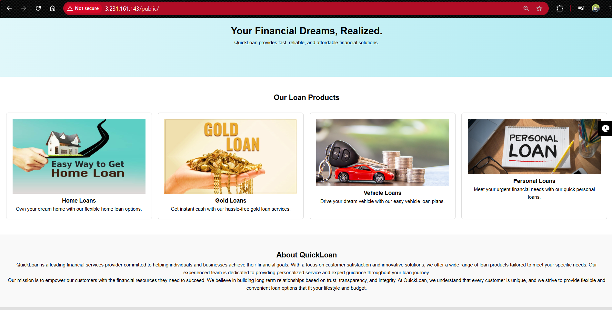
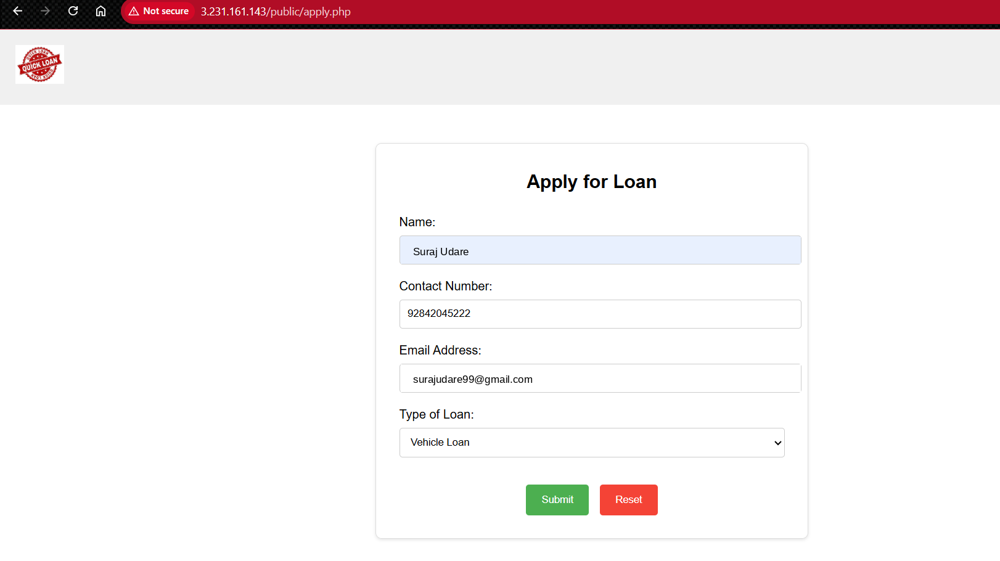
___________________________________________________________________________________________________________________________________________________________________________________________________________________
# Step 1 – Create Networking Components
**1. Create VPC**

>Name: QuickLoan-VPC

>CIDR: 10.10.0.0/16

Purpose:

- Creates an isolated network for all AWS resources.

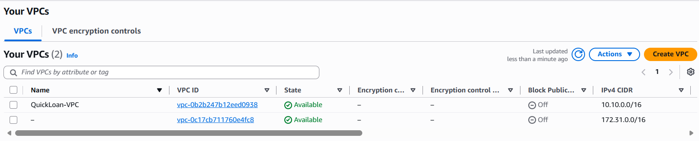

**2. Create Subnets**

>**Public Subnet 1**

>CIDR: 10.10.1.0/24

>AZ: us-east-1a

>**Public Subnet 2**

>CIDR: 10.10.2.0/24

>AZ: us-east-1b

>**Private Subnet**

>CIDR: 10.10.3.0/24

>AZ: us-east-1a

Purpose:

- Public subnets host internet-facing resources.
- Private subnet hosts database resources.

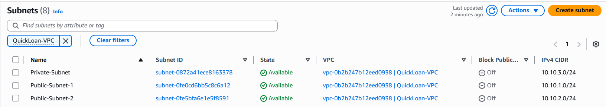

**3. Create Internet Gateway**

>Create IGW

>Attach to QuickLoan-VPC

Purpose:

- Allows internet access to public resources.

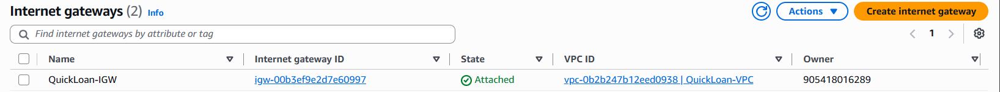

**4. Create NAT Gateway**

>Deploy NAT Gateway **in Public Subnet**

>Allocate Elastic IP

Purpose:

- Allows private resources to access internet for updates without exposing them publicly.

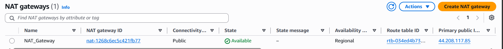

**5. Configure Route Tables**

Create:

>Public Route Table

Route: 

>0.0.0.0/0 → Internet Gateway

Associate with:

>Public Subnet 1
>Public Subnet 2

then create:

>Private Route Table

Route:

>0.0.0.0/0 → NAT Gateway

Associate with:

>Private Subnet

Purpose:

- Controls traffic flow inside VPC.

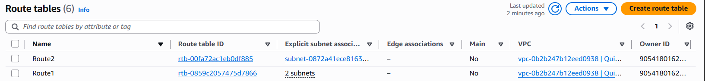

# Step 2 – Configure Security Groups

Create:

>SG-1 (App Servers)

- Inbound Rules as

1. SSH  (22)   → My IP

2. HTTP (80)   → Anywhere

- Outbound as

1. All Traffic → Anywhere

>SG-2 (Database)

- Inbound Rules as

1. MYSQL (3306)  Source → SG-1

- Outbound ad

1. All Traffic

Purpose:

- Only application servers can access database.

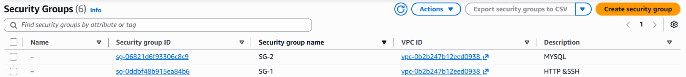

# Step 3 – Launch EC2 Instances

First Launch:

>Amazon Linux Jump Server   

inside Public Subnet 1 and 

With Public IP Enabled

Purpose:

- Secure SSH access point.

then launch:

>Amazon Linux Application Server

inside Public Subnet 2 and 

Purpose:

- Hosts Nginx and PHP application.

Now Launch DBServer:

>Database Server (Red Hat Linux 9) 

inside Private Subnet

with No Public IP

Purpose:

- Used to access private resources.

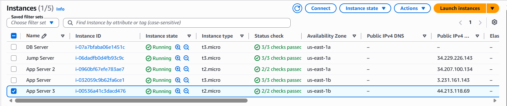

# Step 4 – Configure Application Server

Update packages:

>yum update -y

Install Nginx:

>yum install -y nginx

>systemctl start nginx

>chkconfig nginx on

Verify:

>http://<public-ip>

Install PHP:

>yum install -y php8.2 php-fpm php-mysqlnd php-pdo php-mbstring

>php -v

>systemctl start php-fpm

>chkconfig php-fpm on

>systemctl restart nginx

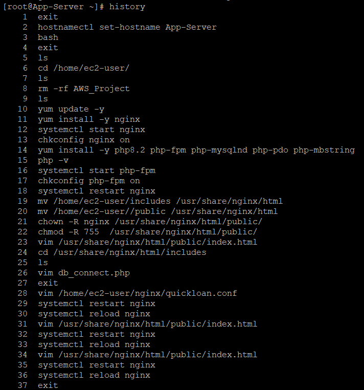

# Step 5 – Upload Website Files

Using WinSCP upload: includes, nginx, public

Move files:

> mv /home/ec2-user/includes /usr/share/nginx/html

> mv /home/ec2-user/public /usr/share/nginx/html

Set permissions:

> chown -R nginx:nginx /usr/share/nginx/html/public

>chmod -R 755 /usr/share/nginx/html/public

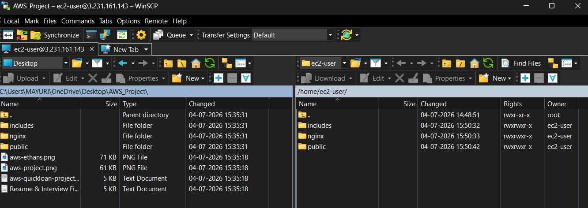

# Step 6 – Create Amazon S3 Bucket

>Create Bucket: AWS_Project_S32026

Configuration:

- ACL Enabled
- Public Access Allowed
- Versioning Disabled

Upload:

- images/

Make images public.

Purpose:

- Stores static images.
- Reduces EC2 storage usage.

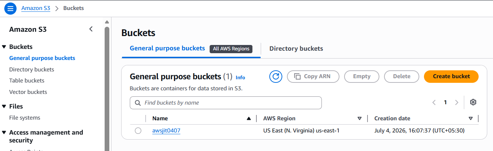

# Step 7 – Update Application Image URLs

Edit:

> vim /usr/share/nginx/html/public/index.html

Replace old S3 bucket URLs with your bucket URL.

Update all image references.

# Step 8 – Configure Database Connection

Edit:

>cd /usr/share/nginx/html/includes

>vim db_connect.php

Update:

    $servername = "customer-db.xxxxx.us-east-1.rds.amazonaws.com";
    $username = "admin";
    $password = "admin123";
    $dbname = "quickloan_db";

Save and exit.

# Step 9 – Create Amazon RDS MySQL

Create Database:

>Engine: MySQL

    DB Identifier: customer-db
    Username: admin
	Password: ********

Connectivity:

- Same VPC
- Private Access
- Security Group: SG-2

Disable:

- Automatic Backups
- Enhanced Monitoring
- Maintenance Window

Launch RDS.

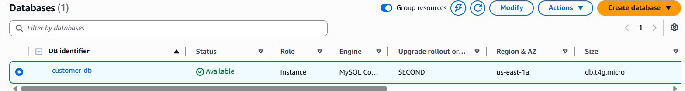

# Step 10 – Create Database Tables

Connect from DB Server:

Install MySQL Client:

>yum install mysql -y

Connect:

    mysql -h <RDS-ENDPOINT> -u admin -p

Create database:

    CREATE DATABASE quickloan_db;
    USE quickloan_db;
    Create table:

>CREATE TABLE applications(

    id INT AUTO_INCREMENT PRIMARY KEY,
    name VARCHAR(255) NOT NULL,
    contact VARCHAR(20) NOT NULL,
    email VARCHAR(255) NOT NULL,
    loan_type VARCHAR(50) NOT NULL

);

Verify:

    SHOW TABLES;
	DESC applications;

# Step 11 – Configure Domain

Create hostname using No-IP.

Example:

quickloan.ddns.net

Point domain to:

Application Load Balancer DNS

Purpose:

- Access application using a friendly URL.

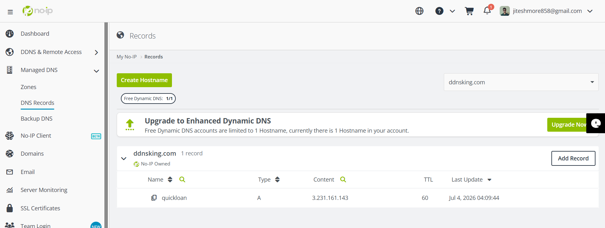

# Step 12 – Configure Nginx Virtual Host

Edit:

>vim /home/ec2-user/nginx/quickloan.conf

Example:

>server {

>listen 80;

>server_name quickloan.ddns.net;

>root /usr/share/nginx/html/public;

>index index.php index.html;

>location / {

>try_files $uri $uri/ /index.php?$query_string;}

>}

Move file:

>mv quickloan.conf /etc/nginx/conf.d/

Validate:

>nginx -t

Restart:

>systemctl restart nginx

>systemctl reload nginx

# Step 13 – Test Application

Open:

>http://quickloan.dds.net

Submit loan application.

Verify data inside RDS:

>SELECT * FROM applications;

# Step 14 – Create AMI

From working App Server:

Actions

→ Image and Templates

→ Create Image

Name:

>App-Server-AMI

Purpose:

- Creates reusable application image.

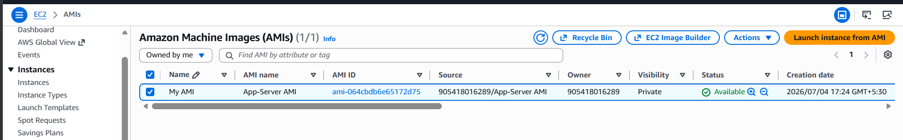

# Step 15 – Create Launch Template

Use:

App-Server-AMI

Configure:

Instance Type

Security Group

Key Pair

Purpose:

- Standard template for Auto Scaling.

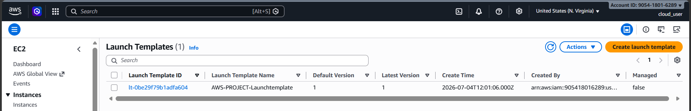

# Step 16 – Create Target Group

>Type: Instance

>Protocol: HTTP

>Port:80

Register application instances.

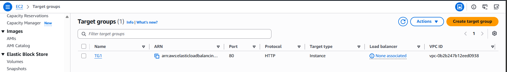

# Step 17 – Create Application Load Balancer

Configure: Internet Facing Public Subnets with HTTP Listener (80)

Attach: Target Group

Purpose:

- Distributes traffic across multiple servers.

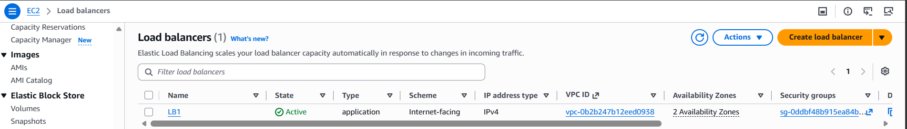

# Step 18 – Create Auto Scaling Group

Use Launch Template.

Configuration:

>Desired Capacity: 2

>Minimum: 2

>Maximum: 4

Attach:

>Application Load Balancer

Purpose:

- Automatically adds/removes instances.

# Step 19 – Monitoring
1. CloudWatch

Create alarms:

>CPU > 80%

>CPU < 20%

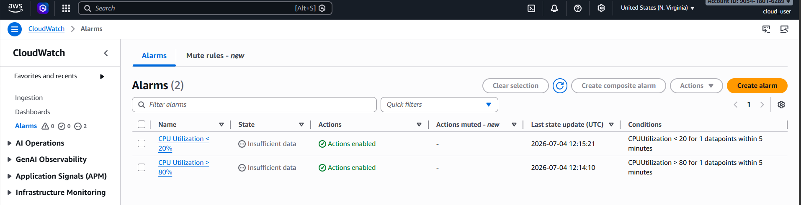

2. SNS

Create topic: QuickLoan-SNS

Subscribe email.

Purpose:

- Sends notifications when alarms trigger.

_____________________________________________________________________________________________________________________________________________________________________________________________________________________________________________________________________________________________
# Architecture Outcome

**The final architecture provides:**

- ✅ Secure network isolation using VPC
- ✅ Public and private subnet segregation
- ✅ Centralized access through Jump Server
- ✅ Scalable application layer using Auto Scaling
- ✅ High availability through ALB and Multi-AZ deployment
- ✅ Managed database using Amazon RDS MySQL
- ✅ Static content delivery through Amazon S3
- ✅ Monitoring and alerting using CloudWatch and SNS

**This design closely resembles a real-world production environment and demonstrates core AWS Infrastructure, Networking, Security, High Availability, and Monitoring concepts.
**
